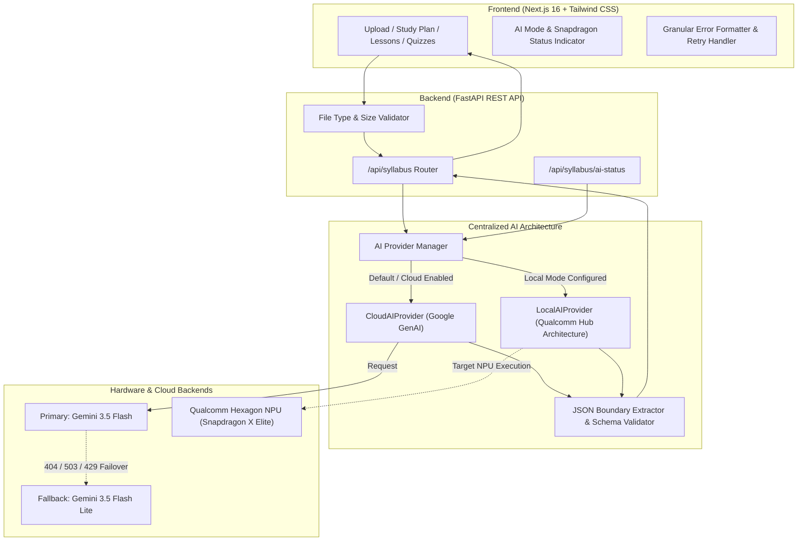
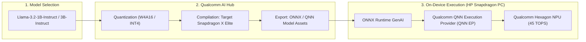

# 🚀 Learnova AI — On-Device Study Companion

<p align="center">
  <strong>Intelligent, Privacy-First Educational Companion Powered by Snapdragon NPU Architecture & Resilient Cloud AI</strong>
</p>

<p align="center">
  <em>Prepared for the Qualcomm Snapdragon AI Lab Build & Present Challenge</em>
</p>

<p align="center">
  
  
  
  
  
</p>

---

## 📌 1. Challenge & Problem Statement

### The Problem
University and high school students face severe academic overload. When presented with expansive 50-page course syllabi, students struggle with three fundamental hurdles:
1. **Unstructured Curricula**: Syllabi outline topics without providing logical pedagogical progression, difficulty weighting, or milestone pacing.
2. **Disconnected Learning Resources**: Students waste hours searching for conceptual explanations and practice problems aligned with their exact course syllabus.
3. **Data Privacy & Cloud Dependency**: Uploading private course materials, draft research, and proprietary university syllabi to centralized cloud APIs creates data privacy concerns, recurring cloud token costs, latency bottlenecks, and unreliability during campus connectivity outages.

### Target Users
- **College & University Students**: Managing 4–6 concurrent subjects who need structured daily study schedules and rapid exam revision.
- **Self-Directed Learners**: Following open-source or custom curriculums requiring targeted interactive testing.
- **Institutions & Educators**: Seeking privacy-preserving study tools that run entirely on student laptops without exposing student data.

---

## 🌟 2. Solution Overview & Core Features

**Learnova AI** transforms static syllabi into an active, personalized learning ecosystem:

| Feature | Capabilities |
|---|---|
| 📄 **Document Parsing** | Ingests PDF and DOCX syllabi, extracting clean, structured text representations. |
| 📚 **Curriculum Analysis** | Extracts course level, modular units, prioritized topics, and difficulty grading. |
| 📅 **Adaptive Study Planner** | Generates pacing across 1–365 days with daily objectives, practice, and revision milestones. |
| 🧠 **Structured Lessons** | Produces comprehensive 13-point instructional lessons (definitions, mechanics, real-world examples, common pitfalls, and practice questions). |
| 📝 **Interactive AI Quizzes** | Generates verified 5-question multiple-choice quizzes with options, answers, and detailed rationale. |
| 🛡️ **Privacy & Local Mode** | Configurable cloud toggle (`ALLOW_CLOUD_PROCESSING`), zero text-logging, and a local NPU inference pathway. |
| ⚡ **Resilient Cloud Fallback** | Primary `gemini-3.5-flash` with exponential backoff retry for HTTP 503/429 and automatic fallback to `gemini-3.5-flash-lite`. |

---

## 🏗️ 3. Architecture & Data Flow

Learnova AI implements a **Centralized Provider Architecture** with strict schema validation:



### Data Processing Pipeline
1. **Document Ingestion**: Syllabus file (`.pdf`/`.docx`) uploaded to `/api/syllabus/upload`. File size (<=10MB) and mime-type verified before saving.
2. **Text Extraction**: Extracted via `pypdf` and `python-docx` without cloud egress.
3. **AI Dispatch**: Request routed through `BaseAIProvider` abstraction. Automatic Function Calling (AFC) disabled to prevent runtime warning overhead.
4. **Resilience & Fallback**:
   - Transient `503` or `429` triggers exponential backoff (1s, 2s, 4s).
   - If the primary model returns `404` or exhausts retries, it switches dynamically to the fallback model.
5. **Schema Validation**: Model output processed by `clean_and_extract_json()`, repairing code fences and trailing commas, and verified against strict schemas before writing to SQLite database.

---

## ⚡ 4. Qualcomm AI Hub & Snapdragon Integration Roadmap

Learnova AI is designed from the ground up to support on-device execution on **Qualcomm Snapdragon X Elite / Plus** platforms (such as the HP OmniBook X).

### Integration Blueprint



### Technical Roadmap:
1. **Model Optimization via Qualcomm AI Hub**:
   - Select small language models optimized for reasoning and instruction following: **Llama-3.2-1B-Instruct** or **Llama-3.2-3B-Instruct**.
   - Compile using `qai-hub` targeting the Hexagon NPU with 4-bit integer weights and 16-bit activations (INT4/W4A16) to maximize memory efficiency.
2. **On-Device Execution Runtime**:
   - Target runtime: **ONNX Runtime GenAI** with `QNNExecutionProvider` on Windows 11 on ARM (ARM64).
   - Direct execution on the dedicated **45 TOPS Hexagon NPU**, freeing CPU and GPU resources for system responsiveness.
3. **Zero-Latency Local Fallback**:
   - `LocalAIProvider` detects available on-device weights. If present on Snapdragon hardware, syllabus parsing and quiz generation run entirely offline.

### Snapdragon HP PC Deployment Requirements:
- **Device**: Snapdragon X Elite or Snapdragon X Plus powered PC (e.g. HP OmniBook X, HP EliteBook Ultra).
- **Operating System**: Windows 11 on ARM64.
- **Hardware Acceleration**: Qualcomm Hexagon NPU (40–45 TOPS).
- **Memory**: 16 GB unified LPDDR5x RAM.
- **Driver / Runtimes**: Qualcomm Neural Processing SDK & ONNX Runtime QNN Execution Provider.

---

## 🔒 5. Privacy & Security Architecture

Student academic files frequently contain private, proprietary, or unpublished research materials. Learnova AI incorporates strict privacy principles:
- **Local-First Processing Option**: Disabling cloud processing via `ALLOW_CLOUD_PROCESSING=false` guarantees zero network transmission of curriculum data.
- **Zero Raw Text Logging**: Application loggers record only operation metadata, token counts, and sanitized errors. Syllabus text and user credentials are never logged.
- **Safe Error Shielding**: API errors never expose internal tracebacks, directory structures, or API keys to the client.
- **Strict User Isolation**: All syllabus records and topic progression are bound to authenticated user sessions via JWT and SQLite foreign keys.

---

## 📊 6. Current Implementation & Verification Status

### Transparent Hardware Disclosure
> [!NOTE]
> The development and testing environment for this prototype is a **Windows 11 PC powered by an AMD Ryzen 7 5700U processor (16 GB RAM)**. It is **not** Snapdragon hardware.
>
> In accordance with challenge rules:
> - **We do not claim NPU acceleration or benchmarks have been run on this AMD machine.**
> - Cloud generation, retries, fallback, schema enforcement, backend security, and UI recovery have been live-tested and verified.
> - Snapdragon NPU execution is modeled and architected through the modular `LocalAIProvider` interface, ready for target compilation.

### Verification Matrix

| Area | Feature | Status | Verification Evidence |
|---|---|---|---|
| **AI Provider** | Centralized `BaseAIProvider` interface | ✅ Complete | Verified in `ai_provider.py` |
| **Cloud AI** | Google GenAI SDK integration | ✅ Complete | Verified with live `gemini-3.5-flash` |
| **Resilience** | Exponential backoff retry on 503/429 | ✅ Complete | Verified via `test_ai_provider.py` |
| **Resilience** | Automatic failover to `gemini-3.5-flash-lite` | ✅ Complete | Verified via `test_ai_provider.py` |
| **Resilience** | Automatic Function Calling (AFC) warning suppression | ✅ Complete | Zero warnings during generation |
| **Structured Output** | Markdown code fence removal & repair | ✅ Complete | Verified via `test_json_parser.py` |
| **Structured Output** | Syllabus schema validation | ✅ Complete | Verified via `test_json_parser.py` |
| **Structured Output** | Study plan schema validation | ✅ Complete | Verified via `test_json_parser.py` |
| **Structured Output** | 13-point Lesson schema validation | ✅ Complete | Verified via `test_json_parser.py` |
| **Structured Output** | 5-question Quiz schema validation | ✅ Complete | Verified via `test_json_parser.py` |
| **Backend** | Fixed broken imports in study, lesson, quiz services | ✅ Complete | Verified across all services |
| **Backend** | File upload extension, size & empty checks | ✅ Complete | Verified via `test_upload_validation.py` |
| **Backend** | `/api/syllabus/ai-status` reporting endpoint | ✅ Complete | Verified via `test_upload_validation.py` |
| **Frontend** | Live AI Mode & Snapdragon Status badge | ✅ Complete | Verified in `frontend/app/syllabus/page.tsx` |
| **Frontend** | Granular HTTP 404/429/503 error feedback | ✅ Complete | Verified in `frontend/app/syllabus/page.tsx` |
| **Frontend** | Actionable Retry buttons for analysis & planning | ✅ Complete | Verified in `frontend/app/syllabus/page.tsx` |
| **Testing** | Comprehensive unit test suite (27 tests) | ✅ Complete | `Ran 27 tests in 0.078s - OK` |
| **Snapdragon NPU** | Physical INT4 compilation on Snapdragon hardware | ⏳ Hardware-Dependent | Documented roadmap for HP Snapdragon PC |

---

## 🛠️ 7. Getting Started & Running the Project

### Prerequisites
- Python 3.11+ (Python 3.14 tested)
- Node.js 18+ and npm
- Windows PowerShell

### 1. Backend Setup
```powershell
cd C:\Learnova-AI\backend

# Activate the virtual environment
.\venv\Scripts\activate

# Configure your environment variables (.env)
cp .env.example .env
# Ensure GEMINI_API_KEY is configured in .env

# Run automated unit tests
python -m unittest discover -s tests -p "test_*.py" -v

# Launch the FastAPI server
uvicorn app.main:app --reload --host 127.0.0.1 --port 8000
```
Backend will be live at: `http://127.0.0.1:8000` (API documentation at `/docs`).

### 2. Frontend Setup
```powershell
cd C:\Learnova-AI\frontend

# Install dependencies (if not already installed)
npm install

# Verify TypeScript compilation
npx tsc --noEmit

# Launch the Next.js development server
npm run dev
```
Frontend will be live at: `http://localhost:3000`.

---

## 🏆 8. Qualcomm Snapdragon AI Lab Submission Summary

- **Project**: Learnova AI — On-Device Study Companion
- **Repository Branch**: `feature/snapdragon-challenge-upgrade`
- **Architecture**: Modular Dual-Engine (Qualcomm AI Hub Snapdragon NPU Target + Resilient Gemini Cloud Fallback)
- **Primary Cloud Model**: `gemini-3.5-flash`
- **Fallback Cloud Model**: `gemini-3.5-flash-lite`
- **Target Hardware**: Qualcomm Snapdragon X Elite / Plus (Hexagon NPU, 45 TOPS)
- **Target OS**: Windows 11 on ARM64
